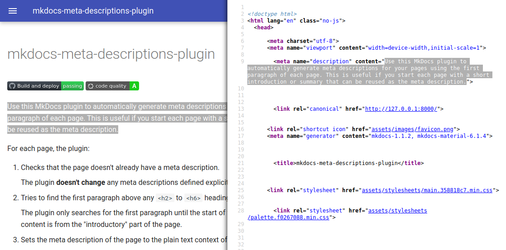

# mkdocs-meta-descriptions-plugin

[](https://github.com/prcr/mkdocs-meta-descriptions-plugin/actions/workflows/build-deploy.yml)
[](https://www.codacy.com/gh/prcr/mkdocs-meta-descriptions-plugin/dashboard?utm_source=github.com&amp;utm_medium=referral&amp;utm_content=prcr/mkdocs-meta-descriptions-plugin&amp;utm_campaign=Badge_Grade)

Use this MkDocs plugin to automatically generate meta descriptions for your pages using the first paragraph of each page. This is useful if you start each page with a short introduction or summary that can be reused as the meta description.



For each page, the plugin:

1.  Checks that the page doesn't already have a meta description.
    
    The plugin **doesn't change** any meta descriptions defined explicitly on the [page meta-data](https://www.mkdocs.org/user-guide/writing-your-docs/#meta-data).

2.  Tries to find the first paragraph above any `<h2>` to `<h6>` headings.
   
    The plugin only searches for the first paragraph until the start of the first section to ensure that the content is from the "introductory" part of the page.

3.  Sets the meta description of the page to the plain text context of the paragraph, stripped of HTML tags.

If the page doesn't have a meta description defined manually by you nor automatically by the plugin, MkDocs sets the meta description of the page to the value of your [`site_description`](https://www.mkdocs.org/user-guide/configuration/#site_description) as a fallback.

> ⚠️ **Important:** to use this plugin, you must either [customize your existing theme](https://www.mkdocs.org/user-guide/styling-your-docs/#overriding-template-blocks) to include the value of [`page.meta.description`](https://www.mkdocs.org/user-guide/custom-themes/#pagemeta) in the HTML element `<meta name="description" content="...">`, or use an [MkDocs theme](https://github.com/mkdocs/mkdocs/wiki/MkDocs-Themes) that already does this by default. I recommend using the excellent [Material theme](https://github.com/squidfunk/mkdocs-material).

## Setting up and using the plugin

To set up and use the plugin:

1.  Install the plugin using pip:

    ```bash
    pip install mkdocs-meta-descriptions-plugin
    ```
    
    Depending on your project, you may also need to add the plugin as a dependency on your `requirements.txt` file.

2.  Activate the plugin in your `mkdocs.yml`:

    ```yaml
    plugins:
      - search
      - meta-descriptions
    ```

    > **Note:** If you have no `plugins` entry in your `mkdocs.yml` file yet, you'll likely also want to add the `search` plugin. MkDocs enables it by default if there is no `plugins` entry set, but now you have to enable it explicitly.
    
3.  Activate the [Meta-Data extension](https://python-markdown.github.io/extensions/meta_data/) in your `mkdocs.yml`:

    ```yaml
    markdown_extensions:
      - meta
    ```

Read more about [using MkDocs plugins](http://www.mkdocs.org/user-guide/plugins/).
